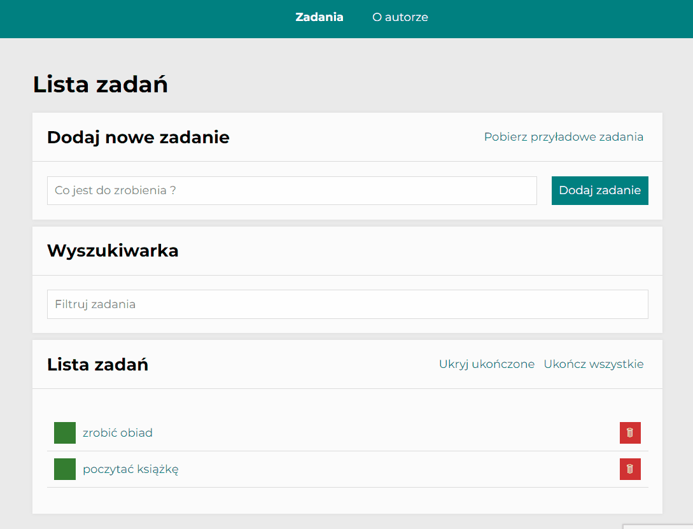
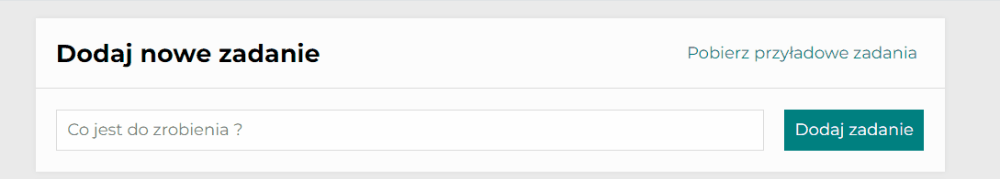
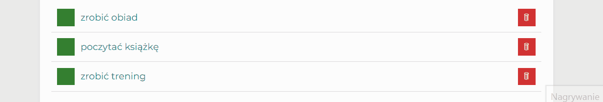
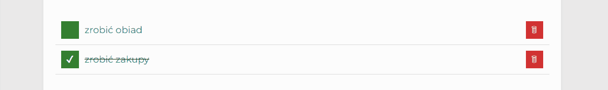
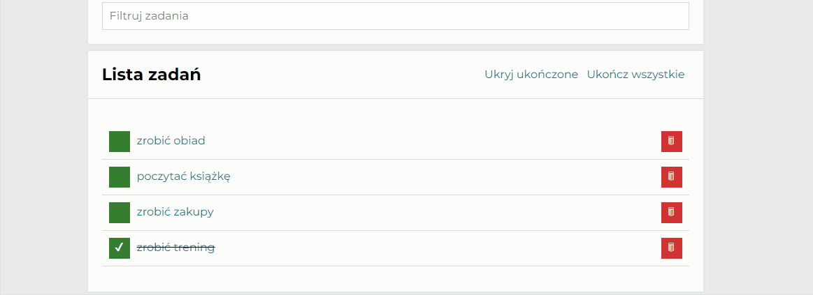
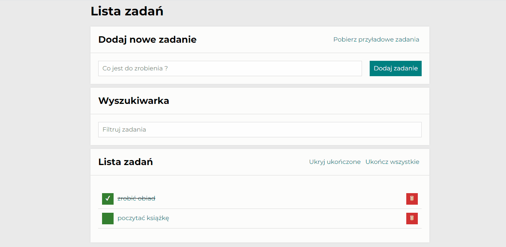
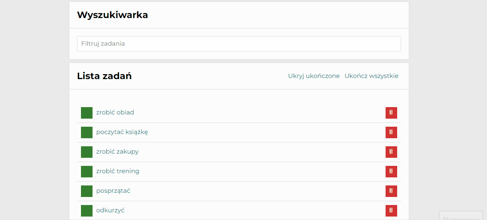
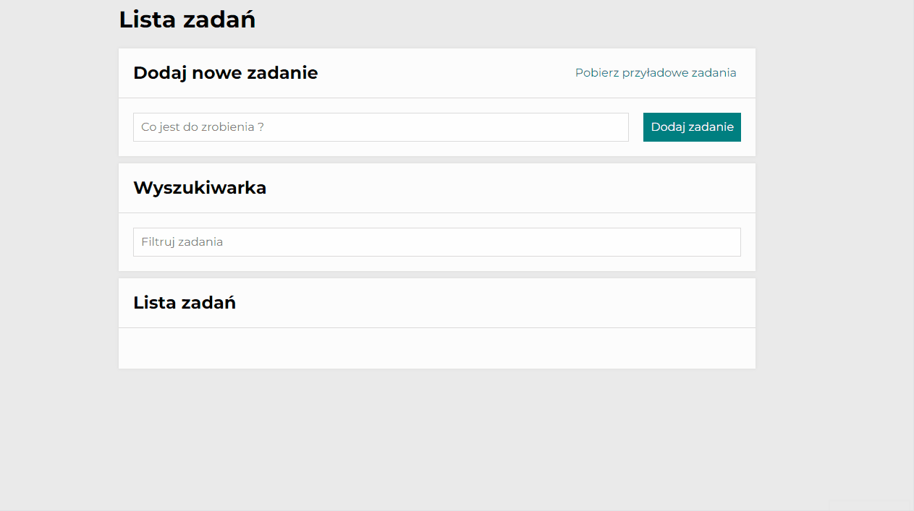

# To do list

## Table of contents:
1. [Description](#description)
1. [Demo](#demo)
1. [Features](#features)
1. [How to use](#how-to-use)
1. [Technologies](#technologies)
1. [Available Scripts](#available-scripts)

## Description
To do list is a tool that helps you stay organized. It allows you to add and manage your tasks. You can easily search for specific tasks. When they are done, you can tick them off or delete. App can be used as to do list or shopping list. You can use it on your computer or phone - so it will always be by your side.

## Demo
https://wiktorianizielska.github.io/todo-list-react/

## Features
- intuitive to use
- interactive buttons that appear depending on the actual state
- responsive design due to media queries
- two main pages - tasks and author - created using React Router
- indiviual subpage for every task
- simple navigation (selected link is bold)
- you can add any task you want
- you can tick the task that you did
- you can remove task form the list
- you can hide done tasks
- you can tick all task with one button 
- your tasks are automatically saved in local storage
- you can download example tasks
- you can filter tasks in search bar

## How to use
1. Input a task that you want to add. 

1. Click adding button - "Dodaj zadanie".

    
1. You can toggle the task to be done by clicking green square.

1. You can delete done task by clicking red square with wastebasket icon.

1. When you add a task, two buttons will appear. You can toggle all tasks to be done (click "Ukończ wszystkie") or hide all done tasks (click "Ukryj ukończone").

1. Click on task content to check indiviual subpage for every task.

1. Type task content in search input to filter your tasks and search the exact one you want.

1. You can download example tasks using button - "Pobierz przyładowe zadania".

## Technologies
- **TypeScript**
- **React**: controlled components, JSX
- **React Hooks**: useState, useRef, custom hooks
- **Redux**: React-Redux, Redux Toolkit  (createSlice, store, useSelector, useDispatch)
- **Redux-Saga**: side effects handling, saving tasks in localStorage
- **React Router**: useParams, useLocation, useHistory
- **Styled-components**
- **Create React App**
- **npm**
- **Webpack**
- **Babel**
- **HTML**
- **CSS**: Media Queries, normalize.css, transition, Flex, Grid, alternative box model
- **JavaScript**: JS modules, arrays, objects, ternary operator, arrow functions, immutabililty
- **JS Async**: asynchronous functions, async/await
- **Fetch**
- error handling: **try/catch**

## Available scripts
In the project directory, you can run:

### `npm start`

Runs the app in the development mode.\
Open [http://localhost:3000](http://localhost:3000) to view it in your browser.

The page will reload when you make changes.\
You may also see any lint errors in the console.

### `npm run build`

Builds the app for production to the `build` folder.\
It correctly bundles React in production mode and optimizes the build for the best performance.

The build is minified and the filenames include the hashes.\
Your app is ready to be deployed!

See the section about [deployment](https://facebook.github.io/create-react-app/docs/deployment) for more information.

### `npm run eject`

**Note: this is a one-way operation. Once you `eject`, you can't go back!**

If you aren't satisfied with the build tool and configuration choices, you can `eject` at any time. This command will remove the single build dependency from your project.

Instead, it will copy all the configuration files and the transitive dependencies (webpack, Babel, ESLint, etc) right into your project so you have full control over them. All of the commands except `eject` will still work, but they will point to the copied scripts so you can tweak them. At this point you're on your own.

You don't have to ever use `eject`. The curated feature set is suitable for small and middle deployments, and you shouldn't feel obligated to use this feature. However we understand that this tool wouldn't be useful if you couldn't customize it when you are ready for it.

